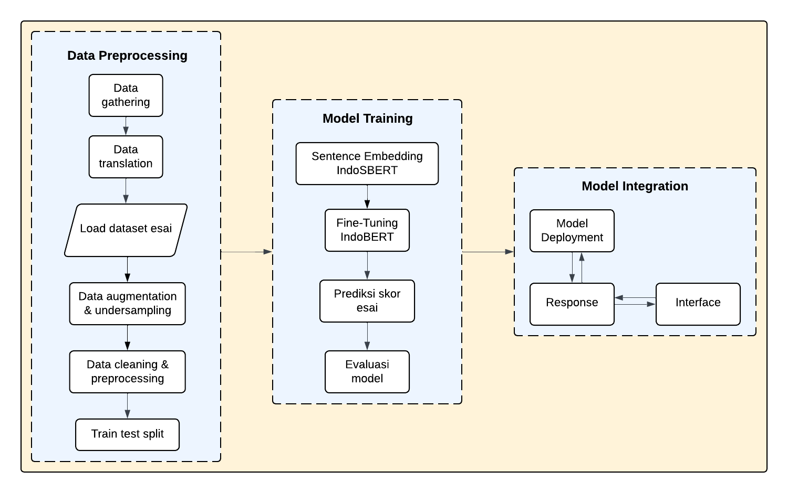
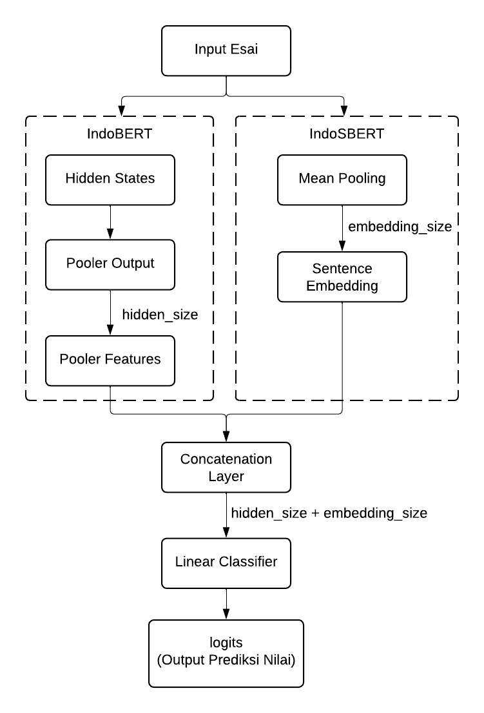

# Implementasi Automated Essay Scoring pada Penilaian Esai Bahasa Indonesia dengan Pendekatan Transfer Learning

Implementasi ini mengintegrasikan fitur IndoBERT dengan IndoSBERT dengan metode concatenation untuk sistem AES ke dalam aplikasi berbasis website.


## Concatenation IndoBERT-IndoSBERT
Penggabungan kedua fitur dilakukan dengan metode concatenation pada function forward sehingga konfigurasi model IndoBERT memiliki tambahan embedding size dari IndoSBERT. Hal ini dilakukan untuk meningkatkan pemahaman model dalam menganalisis esai


## Model Training
Sebelum model training, terdapat 2 tahap utama yaitu, data preprocessing dan integrasi IndoBERT dengan IndoSBERT.

Seluruh tahap dapat dilakukan dengan menjalankan file notebook yang telah disediakan dengan mengunduh beberapa library terlebih dahulu. Dataset final juga telah tersedia pada file `final_data.csv`.

Proses instalasi library dapat langsung dilakukan dengan menjalankan command berikut:
```
pip install -r requirements_model.txt
```
## Aplikasi Website
Aplikasi website dibuat dengan ReactJS untuk frontend, dan FastAPI untuk backend.

### Run frontend
Tahap pertama yang perlu dilakukan adalah menjalankan command untuk mengunduh seluruh node modules yang diperlukan:
```
cd Website
npm init
npm install
```
Kemudian, untuk melihat tampilan website dapat menajalankan command berikut yang nantinya akan menghasilkan link localhost yang dapat dibuka:
```
npm run dev
```

### Akses endpoint dari FastAPI
Install library yang dibutuhkan terlebih dahulu dengan menjalankan command berikut:
```
cd Website
cd backend
pip install -r requirements_be.txt
```
Sebelum menjalankan endpoint, pastikan folder model yang tersedia telah ada di folder yang sama dengan file `api.py`.

Kemudian, jalankan command berikut untuk menjalankan dan mendapatkan link endpoint yang dapat diakses:
```
uvicorn api:app --reload
```

Dengan demikian, aplikasi website dapat digunakan untuk mengunggah esai agar mendapatkan hasil berupa skor tata bahasa esai.
